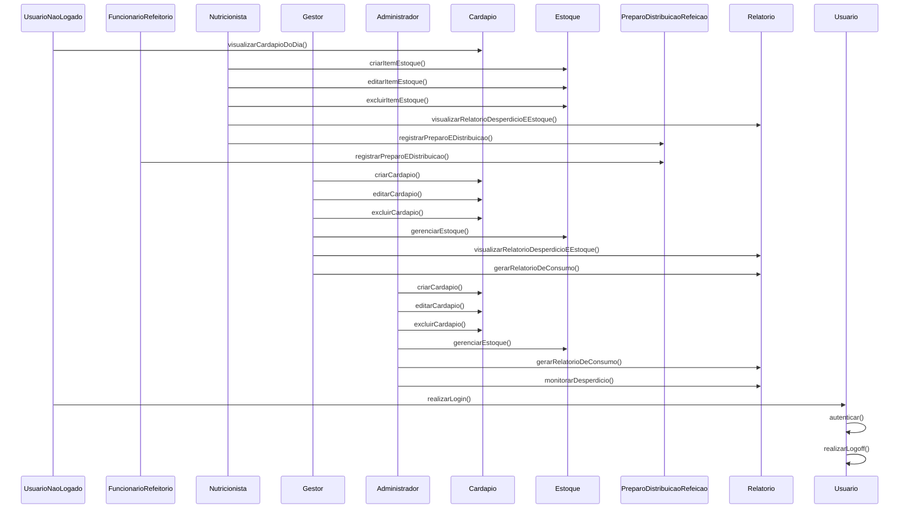

## Diagrama de Interação

```mermaid
sequenceDiagram
    participant UsuarioNaoLogado
    participant FuncionarioRefeitorio
    participant Nutricionista
    participant Gestor
    participant Administrador
    participant Cardapio
    participant Estoque
    participant PreparoDistribuicaoRefeicao
    participant Relatorio

    UsuarioNaoLogado->>Cardapio: visualizarCardapioDoDia()
    Nutricionista->>Estoque: criarItemEstoque()
    Nutricionista->>Estoque: editarItemEstoque()
    Nutricionista->>Estoque: excluirItemEstoque()
    Nutricionista->>Relatorio: visualizarRelatorioDesperdicioEEstoque()
    Nutricionista->>PreparoDistribuicaoRefeicao: registrarPreparoEDistribuicao()
    
    FuncionarioRefeitorio->>PreparoDistribuicaoRefeicao: registrarPreparoEDistribuicao()
    
    Gestor->>Cardapio: criarCardapio()
    Gestor->>Cardapio: editarCardapio()
    Gestor->>Cardapio: excluirCardapio()
    Gestor->>Estoque: gerenciarEstoque()
    Gestor->>Relatorio: visualizarRelatorioDesperdicioEEstoque()
    Gestor->>Relatorio: gerarRelatorioDeConsumo()
    
    Administrador->>Cardapio: criarCardapio()
    Administrador->>Cardapio: editarCardapio()
    Administrador->>Cardapio: excluirCardapio()
    Administrador->>Estoque: gerenciarEstoque()
    Administrador->>Relatorio: gerarRelatorioDeConsumo()
    Administrador->>Relatorio: monitorarDesperdicio()
    
    UsuarioNaoLogado->>Usuario: realizarLogin()
    Usuario->>Usuario: autenticar()
    Usuario->>Usuario: realizarLogoff()
```
