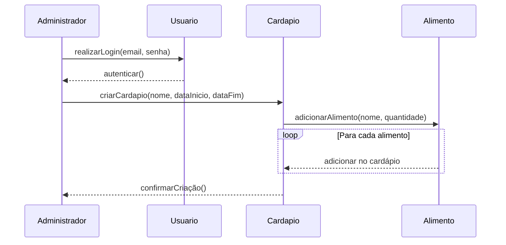

```mermaid
sequenceDiagram
    participant Administrador
    participant Usuario
    participant Cardapio
    participant Alimento

    Administrador->>Usuario: realizarLogin(email, senha)
    Usuario-->>Administrador: autenticar()
    
    Administrador->>Cardapio: criarCardapio(nome, dataInicio, dataFim)
    Cardapio->>Alimento: adicionarAlimento(nome, quantidade)
    loop Para cada alimento
        Alimento-->>Cardapio: adicionar no cardápio
    end
    Cardapio-->>Administrador: confirmarCriação()
```
